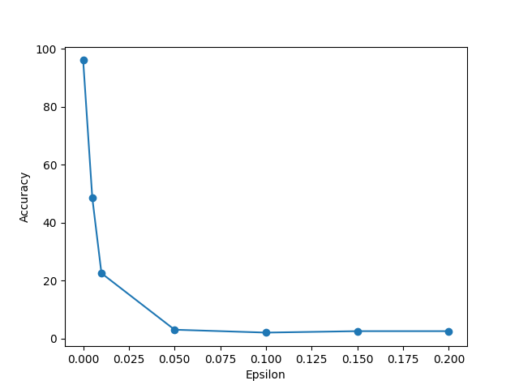

## Постановка задачи:
Разработка методов генерации adversarial примеров и оценка их воздействия на предобученные нейросетевые модели для классификации и обнаружения людей, с акцентом на анализ изменений в точности(accuracy) моделей при использовании как стандартного тестового набора данных, так и набора данных, состоящего из adversarial примеров, сгененрированных с помощью различных методов атак при различных гиперпараметрах.

## Иследуемые предобученные модели.
Для анализа использовались модели, предобученные на наборе данных ImageNet, из модуля [torchvision](https://pytorch.org/vision/stable/) библиотеки [PyTorch](https://pytorch.org/).

Для задачи обнаружения объектов в модуле доступны следующие модели:
- [**Faster R-CNN**](https://pytorch.org/vision/stable/models/faster_rcnn.html);
- [**RetinaNet**](https://pytorch.org/vision/stable/models/retinanet.html);
- [**SSD**](https://pytorch.org/vision/stable/models/ssd.html);
- [**SSDlite**](https://pytorch.org/vision/stable/models/ssdlite.html).

В backbone моделей, приведенных выше, используютя следующие модели классификации:
- [**ResNet50**](https://pytorch.org/vision/main/models/generated/torchvision.models.resnet50.html#torchvision.models.resnet50) с механизмом Feature Pyramid Network(FPN) для более эффективного извлечения признаков;
- [**MobileNet V3**](https://pytorch.org/vision/main/models/generated/torchvision.models.mobilenet_v3_large.html#torchvision.models.mobilenet_v3_large);
- [**VGG-16**](https://pytorch.org/vision/main/models/generated/torchvision.models.vgg16.html#torchvision.models.vgg16).

Было принято решение использовать предобученные на наборе данных [ImageNet](https://image-net.org/index.php) модели классификации, представляющие backbone моделей обнаружения объектов, для проведения исследоваения.

## Тестовый набор данных.
Для оценки точности предобученнах моделей, был собран и аннотирован тестовый набор данных, состоящий из 200 изображений различных классов из набора данных ImageNet.

Набор данных представлен в репозитории -- [тестовый набор данных](dataset/)

Папка [images](dataset/images/) содержит изображения, входящие в тестовый набор данных.
Файл [labels.csv](dataset/labels.csv) содержит в себе аннотации к изображениям.  

### Оценка точности предобученных моделей на тестовом наборе данных.
- **ResNet50** 
  Точность модели на тестовом наборе: 96.00 %
- **MobileNet V3** 
  Точность модели на тестовом наборе: 89.50 %
- **VGG-16** 
  Точность модели на тестовом наборе: 83.00 %

#### Пример первых пяти изображений и их классов из тестового набора данных.

## Классификация состязательных атак (Adversarial Attacks).

Состязательная атака (adversarial attack) – это воздействие на нейронную сеть при помощи изменения исходных данных с целью получения неверного результата классификации.

Можно выделить 5 основных критериев классификации состязательных атак:

1. **Результат воздействия на систему**:
   - Изменение поведения;
   - Нарушение конфиденциальности.

2. **Вид атаки**:
   - Атака отравления;
   - Атака уклонения;
   - Атака BadNets.

3. **Наличие информации о модели**:
   - Белый ящик;
   - Черный ящик;
   - Серый ящик.

4. **Тип атаки**:
   - Целевая атака;
   - Нецелевая атака.

5. **Тип применимости**:
   - Виртуальная/цифровая;
   - Физическая.

#### Атаки изменения поведения

Атаки изменения поведения ставят своей целью изменить результат работы модели, то есть нарушить целостность системы. 

#### Атаки нарушения конфиденциальности

Атаки нарушения конфиденциальности ставят своей целью получение доступа к различным артефактам сети, таким как обучающие данные, архитектура, веса обученной модели и т.д. Также сюда относятся атаки, позволяющие узнать что-то об обучающей выборке или получить модель, которая копирует функционал исходной модели.

#### Атака отравления данных

Атака отравления данных – это задача двухуровневой оптимизации по измененным обучающим данным и по ответу обученной модели. Целью данной атаки является изменение ответа обученной модели.

При обучении модели на открытых наборах данных злоумышленники могут легко их «отравить». Злоумышленники заведомо дают ложный ответ в качестве верного, тем самым отравляя обучающую выборку. На открытых наборах данных экспериментально показано, что при полной доступности параметров модели можно внести в нее критические ошибки.

#### Атаки уклонения

Атаки уклонения (evasion attacks) представляют собой методики, с помощью которых злоумышленники могут вводить небольшие возмущения в входные данные, чтобы обмануть модель машинного обучения и заставить её выдать неправильные результаты. Эти атаки являются серьезной угрозой для безопасности и надежности систем, основанных на глубоких нейронных сетях.

#### Типы атак по доступности информации:

- Атаки с белым ящиком (white-box attacks) 
Атака, при которой злоумышленник имеет полный доступ к информации о модели, включая архитектуру, веса и данные обучения. В этом случае он может получить и использовать внутреннюю информацию модели, такую как веса модели и данные обучения. 
*Пример*: злоумышленник знает архитектуру нейронной сети, все параметры и имеет доступ к обучающему набору данных.
- Атаки с черным ящиком (black-box attacks) 
Атака, при которой злоумышленник не может получить никакую информацию о модели во время процесса генерации враждебных примеров и может использовать только выходные данные модели. В реальных сценариях получения внутренней информации о целевых системах невозможно, поэтому атаки с черным ящиком более применимы.
*Пример*: злоумышленник имеет доступ только к выходным данным модели (например, к предсказанным меткам или вероятностям), но не знает внутренней структуры или параметров модели.
- Атаки "серого ящика" (gray box) 
Атаки, сочетающие характеристики атак "белого" и "черного" ящиков. В этом случае атакующий располагает частичной информацией о модели, что делает такие атаки более реалистичными, но все же накладывает некоторые ограничения. Например, может быть известна архитектура модели или информация о данных, на которых модель была обучена, однако отсутствовать доступ к самим данным или обученным весам.

#### Типы атак по целенаправленности:

- Нецелевая атака 
Атаки, целью которых является изменение предсказания модели на любой другой класс, отличный от правильного. Эти атаки проще в реализации.
- Целевая атака 
Атаки, целью которых является вынудить модель выдать предсказание конкретного класса. Эти атаки сложнее в реализации, так как требуют более точных возмущений.

## **Реализация наиболее распространенных состязательных атак.**

#### Метод Быстрого Знака Градиента(FGSM)
Этот метод был описан в данной статье:

- [Explaining and Harnessing Adversarial Examples](https://arxiv.org/pdf/1412.6572)

Это классический метод атаки белого ящика, который указывает, что из-за нелинейности глубоких нейронных сетей даже небольшое возмущение, добавленное к входу, достаточно для того, чтобы ввести нейронную сеть в заблуждение при классификации.

Файл [FGSM.py](FGSM.py) содержит функцию fsgm(), являющейся реализацией нецеловой атаки на изображение с помощью метода FGSM.

Метод был протестирован с различними значениями epsilon: 0.01, 0.05, 0.1, 0.15, 0.2, 0.25, 0.3. Так как при значениях epsilon больше, чем 0.3, наличие шума становится отчетливо визуально отличимо.

- **ResNet50** 

  Точность модели на тестовом наборе при epsilon = 0.01 : 51.00 %

  Количество изображений, поменявших свой класс: 98
  

  Точность модели на тестовом наборе при epsilon = 0.05 : 44.50 %

  Количество изображений, поменявших свой класс: 111
  
  
  
  Точность модели на тестовом наборе при epsilon = 0.1 : 47.50 %

  Количество изображений, поменявших свой класс: 105
  
  
  
  Точность модели на тестовом наборе при epsilon = 0.15 : 52.00 %
  
  Количество изображений, поменявших свой класс: 96
  
  
  
  Точность модели на тестовом наборе при epsilon = 0.2 : 54.00 %
  
  Количество изображений, поменявших свой класс: 92
  
  
  
  Точность модели на тестовом наборе при epsilon = 0.25 : 51.50 %
  
  Количество изображений, поменявших свой класс: 97
  
  
  
  Точность модели на тестовом наборе при epsilon = 0.3 : 53.50 %
  
  Количество изображений, поменявших свой класс: 93
  
  
  
  График зависимости точности от параметра epsilon
  
  

- **MobileNet V3** 

  Точность модели на тестовом наборе при epsilon = 0.01 : 25.00 %

  Количество изображений, поменявших свой класс: 150

  

  Точность модели на тестовом наборе при epsilon = 0.05 : 17.50 %

  Количество изображений, поменявших свой класс: 165

  

  Точность модели на тестовом наборе при epsilon = 0.1 : 18.00 %

  Количество изображений, поменявших свой класс: 164

  

  Точность модели на тестовом наборе при epsilon = 0.15 : 20.50 %

  Количество изображений, поменявших свой класс: 159

  

  Точность модели на тестовом наборе при epsilon = 0.2 : 22.50 %

  Количество изображений, поменявших свой класс: 155

  

  Точность модели на тестовом наборе при epsilon = 0.25 : 22.50 %

  Количество изображений, поменявших свой класс: 155

  

  Точность модели на тестовом наборе при epsilon = 0.3 : 21.50 %

  Количество изображений, поменявших свой класс: 157

  

  График зависимости точности от параметра epsilon

  
  
- **VGG-16** 

  Точность модели на тестовом наборе при epsilon = 0.01 : 20.50 %
  
  Количество изображений, поменявших свой класс: 159
  
  
  
  Точность модели на тестовом наборе при epsilon = 0.05 : 9.50 %
  
  Количество изображений, поменявших свой класс: 181
  
  
  
  Точность модели на тестовом наборе при epsilon = 0.1 : 8.50 %
  
  Количество изображений, поменявших свой класс: 183
  
  
  
  Точность модели на тестовом наборе при epsilon = 0.15 : 7.50 %
  
  Количество изображений, поменявших свой класс: 185
  
  
  
  Точность модели на тестовом наборе при epsilon = 0.2 : 7.50 %
  
  Количество изображений, поменявших свой класс: 185
  
  
  
  Точность модели на тестовом наборе при epsilon = 0.25 : 8.50 %
  
  Количество изображений, поменявших свой класс: 183
  
  
  
  Точность модели на тестовом наборе при epsilon = 0.3 : 8.50 %
  
  Количество изображений, поменявших свой класс: 183
  
  
  
  График зависимости точности от параметра epsilon

  

#### **Итеративный Метод Быстрого Знака Градиента(I-FGSM)**
Этот метод был описан в данной статье:

-[Adversarial examples in the physical world](https://arxiv.org/pdf/1412.6572)

Метод I-FGSM (Iterative Fast Gradient Sign Method) является усовершенствованной версией FGSM. В отличие от FGSM, который выполняет одно обновление на основе градиента функции потерь, I-FGSM выполняет несколько шагов, что позволяет более эффективно находить оптимальные искажения.

Файл [I_FGSM.py](I_FGSM.py) содержит функцию i_fgsm(), являющейся реализацией нецеловой атаки на изображение с помощью метода FGSM.

Метод был протестирован с различными значениями epsilon: 0.001, 0.005, 0.01, 0.05, 0.1, 0.15 и 10 итерациями, так как при значениях epsilon больше, чем 0.15, наличие шума становится отчетливо визуально отличимо.

Пример изображения при значении epsilon = 0.2

- **ResNet50** 
  
  Точность модели на тестовом наборе при epsilon = 0.001 и 10 итерациях: 18.00 %

  Количество изображений, поменявших свой класс: 164

  

  Точность модели на тестовом наборе при epsilon = 0.005 и 10 итерациях: 2.00 % 

  Количество изображений, поменявших свой класс: 196

  

  Точность модели на тестовом наборе при epsilon = 0.01 и 10 итерациях: 2.00 %

  Количество изображений, поменявших свой класс: 196

  

  Точность модели на тестовом наборе при epsilon = 0.05 и 10 итерациях: 1.00 %

  Количество изображений, поменявших свой класс: 198

  

  Точность модели на тестовом наборе при epsilon = 0.1 и 10 итерациях: 0.50 %

  Количество изображений, поменявших свой класс: 199

  

  Точность модели на тестовом наборе при epsilon = 0.15 и 10 итерациях: 0.50 %

  Количество изображений, поменявших свой класс: 199

  

  График зависимости точности от параметра epsilon

  
  
- **MobileNet V3** 

  Точность модели на тестовом наборе при epsilon = 0.001 и 10 итерациях: 13.00 %

  Количество изображений, поменявших свой класс: 174

  

  Точность модели на тестовом наборе при epsilon = 0.005 и 10 итерациях: 7.50 %

  Количество изображений, поменявших свой класс: 185

  

  Точность модели на тестовом наборе при epsilon = 0.01 и 10 итерациях: 6.50 %

  Количество изображений, поменявших свой класс: 187

  

  Точность модели на тестовом наборе при epsilon = 0.05 и 10 итерациях: 4.00 %

  Количество изображений, поменявших свой класс: 192

  

  Точность модели на тестовом наборе при epsilon = 0.1 и 10 итерациях: 2.50 %

  Количество изображений, поменявших свой класс: 195

  

  Точность модели на тестовом наборе при epsilon = 0.15 и 10 итерациях: 2.00 %

  Количество изображений, поменявших свой класс: 196

  

  График зависимости точности от параметра epsilon

    
  
- **VGG-16** 

  Точность модели на тестовом наборе при epsilon = 0.001 и 10 итерациях: 9.50 %
  
  Количество изображений, поменявших свой класс: 181

  

  Точность модели на тестовом наборе при epsilon = 0.005 и 10 итерациях: 8.50 %

  Количество изображений, поменявших свой класс: 183

  

  Точность модели на тестовом наборе при epsilon = 0.01 и 10 итерациях: 7.50 %

  Количество изображений, поменявших свой класс: 185

  

  Точность модели на тестовом наборе при epsilon = 0.05 и 10 итерациях: 5.50 %

  Количество изображений, поменявших свой класс: 189

  

  Точность модели на тестовом наборе при epsilon = 0.1 и 10 итерациях: 3.50 %

  Количество изображений, поменявших свой класс: 193

  

  Точность модели на тестовом наборе при epsilon = 0.15 и 10 итерациях: 3.00 %

  Количество изображений, поменявших свой класс: 194

  

  График зависимости точности от параметра epsilon

  

#### **Basic Iterative Method(BIM)**
Этот метод был описан в данной статье:

- [Adversarial examples in the physical world ](https://arxiv.org/pdf/1607.02533)

Метод BIM является расширением метода FGSM (Fast Gradient Sign Method). BIM выполняет FGSM с меньшим шагом и обрезает обновленный состязательный пример в допустимый диапазон на протяжении заданного количества итераций.

Файл [BIM.py](BIM.py) содержит функцию bim(), являющейся реализацией нецеловой атаки на изображение с помощью метода BIM.

Метод был протестирован с различными значениями epsilon: 0.001, 0.005, 0.01, 0.05, 0.1, 0.15, alpha: 0.001, 0.002, 0.005 и 10 итерациями, так как при значениях epsilon больше, чем 0.15, наличие шума становится отчетливо визуально отличимо.

- **ResNet50** 

  - **alpha = 0.001** 
  
    Точность модели на тестовом наборе при eps=0.001, alpha = 0.001 и 10 итерациях: 10.50
  
    Количество изображений, поменявших свой класс: 179
  
    
  
    Точность модели на тестовом наборе при eps=0.005, alpha = 0.001 и 10 итерациях: 11.50
  
    Количество изображений, поменявших свой класс: 177
  
    
  
    Точность модели на тестовом наборе при eps=0.01, alpha = 0.001 и 10 итерациях: 16.00
  
    Количество изображений, поменявших свой класс: 168
  
    
  
    Точность модели на тестовом наборе при eps=0.05, alpha = 0.001 и 10 итерациях: 30.50
  
    Количество изображений, поменявших свой класс: 139
  
    
    
    Точность модели на тестовом наборе при eps=0.1, alpha = 0.001 и 10 итерациях: 30.00
  
    Количество изображений, поменявших свой класс: 140
  
    
  
    Точность модели на тестовом наборе при eps=0.15, alpha = 0.001 и 10 итерациях: 26.50
  
    Количество изображений, поменявших свой класс: 147
  
    
  
    График зависимости точности от параметра epsilon при alpha = 0.001
  
    

  - **alpha = 0.002** 

    Точность модели на тестовом наборе при eps=0.001, alpha = 0.002 и 10 итерациях: 4.00
    
    Количество изображений, поменявших свой класс: 192
  
    
  
    Точность модели на тестовом наборе при eps=0.005, alpha = 0.002 и 10 итерациях: 5.00
  
    Количество изображений, поменявших свой класс: 190
  
    
  
    Точность модели на тестовом наборе при eps=0.01, alpha = 0.002 и 10 итерациях: 6.00
  
    Количество изображений, поменявших свой класс: 188
  
    
  
    Точность модели на тестовом наборе при eps=0.05, alpha = 0.002 и 10 итерациях: 24.50
  
    Количество изображений, поменявших свой класс: 151
  
    
  
    Точность модели на тестовом наборе при eps=0.1, alpha = 0.002 и 10 итерациях: 23.50
  
    Количество изображений, поменявших свой класс: 153
  
    
  
    Точность модели на тестовом наборе при eps=0.15, alpha = 0.002 и 10 итерациях: 17.00
  
    Количество изображений, поменявших свой класс: 166
  
    
  
    График зависимости точности от параметра epsilon при alpha = 0.002
  
    

  - **alpha = 0.005** 
    
    Точность модели на тестовом наборе при eps=0.001, alpha = 0.005 и 10 итерациях: 2.50

    Количество изображений, поменявших свой класс: 195
    
    

    Точность модели на тестовом наборе при eps=0.005, alpha = 0.005 и 10 итерациях: 2.50

    Количество изображений, поменявших свой класс: 195

    

    Точность модели на тестовом наборе при eps=0.01, alpha = 0.005 и 10 итерациях: 2.50

    Количество изображений, поменявших свой класс: 195

    

    Точность модели на тестовом наборе при eps=0.05, alpha = 0.005 и 10 итерациях: 7.00

    Количество изображений, поменявших свой класс: 186

    

    Точность модели на тестовом наборе при eps=0.1, alpha = 0.005 и 10 итерациях: 8.00

    Количество изображений, поменявших свой класс: 184

    

    Точность модели на тестовом наборе при eps=0.15, alpha = 0.005 и 10 итерациях: 4.50

    Количество изображений, поменявших свой класс: 191

    

    График зависимости точности от параметра epsilon при alpha = 0.005

    
  
- **MobileNet V3** 
  - **alpha = 0.001** 

    Точность модели на тестовом наборе при eps=0.001, alpha = 0.001 и 10 итерациях: 9.50

    Количество изображений, поменявших свой класс: 181

    

    Точность модели на тестовом наборе при eps=0.005, alpha = 0.001 и 10 итерациях: 9.50

    Количество изображений, поменявших свой класс: 181

    

    Точность модели на тестовом наборе при eps=0.01, alpha = 0.001 и 10 итерациях: 9.50

    Количество изображений, поменявших свой класс: 181

    

    Точность модели на тестовом наборе при eps=0.05, alpha = 0.001 и 10 итерациях: 9.00

    Количество изображений, поменявших свой класс: 182

    

    Точность модели на тестовом наборе при eps=0.1, alpha = 0.001 и 10 итерациях: 8.00

    Количество изображений, поменявших свой класс: 184

    

    Точность модели на тестовом наборе при eps=0.15, alpha = 0.001 и 10 итерациях: 5.50

    Количество изображений, поменявших свой класс: 189

    
    
    График зависимости точности от параметра epsilon при alpha = 0.001

    
    
  - **alpha = 0.002** 
  
    Точность модели на тестовом наборе при eps=0.001, alpha = 0.002 и 10 итерациях: 8.00

    Количество изображений, поменявших свой класс: 184

    

    Точность модели на тестовом наборе при eps=0.005, alpha = 0.002 и 10 итерациях: 7.50

    Количество изображений, поменявших свой класс: 185

    

    Точность модели на тестовом наборе при eps=0.01, alpha = 0.002 и 10 итерациях: 7.50

    Количество изображений, поменявших свой класс: 185

    

    Точность модели на тестовом наборе при eps=0.05, alpha = 0.002 и 10 итерациях: 7.50

    Количество изображений, поменявших свой класс: 185

    

    Точность модели на тестовом наборе при eps=0.1, alpha = 0.002 и 10 итерациях: 6.50

    Количество изображений, поменявших свой класс: 187

    

    Точность модели на тестовом наборе при eps=0.15, alpha = 0.002 и 10 итерациях: 2.50

    Количество изображений, поменявших свой класс: 195
 
    

    График зависимости точности от параметра epsilon при alpha = 0.002

    
    
  - **alpha = 0.005** 

    Точность модели на тестовом наборе при eps=0.001, alpha = 0.005 и 10 итерациях: 7.00
    
    Количество изображений, поменявших свой класс: 186

    

    Точность модели на тестовом наборе при eps=0.005, alpha = 0.005 и 10 итерациях: 6.50

    Количество изображений, поменявших свой класс: 187

    

    Точность модели на тестовом наборе при eps=0.01, alpha = 0.005 и 10 итерациях: 6.00

    Количество изображений, поменявших свой класс: 188

    

    Точность модели на тестовом наборе при eps=0.05, alpha = 0.005 и 10 итерациях: 7.50

    Количество изображений, поменявших свой класс: 185

    

    Точность модели на тестовом наборе при eps=0.1, alpha = 0.005 и 10 итерациях: 4.00

    Количество изображений, поменявших свой класс: 192

    

    Точность модели на тестовом наборе при eps=0.15, alpha = 0.005 и 10 итерациях: 1.50

    Количество изображений, поменявших свой класс: 197

    

    График зависимости точности от параметра epsilon при alpha = 0.005

        
  
- **VGG-16** 
  - **alpha = 0.001** 
  
    Точность модели на тестовом наборе при eps=0.001, alpha = 0.001 и 10 итерациях: 9.50

    Количество изображений, поменявших свой класс: 181

    

    Точность модели на тестовом наборе при eps=0.005, alpha = 0.001 и 10 итерациях: 8.00

    Количество изображений, поменявших свой класс: 184

    

    Точность модели на тестовом наборе при eps=0.01, alpha = 0.001 и 10 итерациях: 7.50

    Количество изображений, поменявших свой класс: 185

    

    Точность модели на тестовом наборе при eps=0.05, alpha = 0.001 и 10 итерациях: 5.00

    Количество изображений, поменявших свой класс: 190

    

    Точность модели на тестовом наборе при eps=0.1, alpha = 0.001 и 10 итерациях: 4.50

    Количество изображений, поменявших свой класс: 191

    

    Точность модели на тестовом наборе при eps=0.15, alpha = 0.001 и 10 итерациях: 2.50

    Количество изображений, поменявших свой класс: 195

    

    График зависимости точности от параметра epsilon при alpha = 0.001

    

  - **alpha = 0.002** 
  
    Точность модели на тестовом наборе при eps=0.001, alpha = 0.002 и 10 итерациях: 8.50

    Количество изображений, поменявших свой класс: 183

    

    Точность модели на тестовом наборе при eps=0.005, alpha = 0.002 и 10 итерациях: 8.50

    Количество изображений, поменявших свой класс: 183

    

    Точность модели на тестовом наборе при eps=0.01, alpha = 0.002 и 10 итерациях: 8.00

    Количество изображений, поменявших свой класс: 184

    

    Точность модели на тестовом наборе при eps=0.05, alpha = 0.002 и 10 итерациях: 6.00

    Количество изображений, поменявших свой класс: 188

    

    Точность модели на тестовом наборе при eps=0.1, alpha = 0.002 и 10 итерациях: 3.00

    Количество изображений, поменявших свой класс: 194

    

    Точность модели на тестовом наборе при eps=0.15, alpha = 0.002 и 10 итерациях: 2.00

    Количество изображений, поменявших свой класс: 196

    

    График зависимости точности от параметра epsilon при alpha = 0.002

    

  - **alpha = 0.005** 
  
    Точность модели на тестовом наборе при eps=0.001, alpha = 0.002 и 10 итерациях: 8.00

    Количество изображений, поменявших свой класс: 184

    

    Точность модели на тестовом наборе при eps=0.005, alpha = 0.002 и 10 итерациях: 8.50

    Количество изображений, поменявших свой класс: 183

    

    Точность модели на тестовом наборе при eps=0.01, alpha = 0.002 и 10 итерациях: 8.00

    Количество изображений, поменявших свой класс: 184

    

    Точность модели на тестовом наборе при eps=0.05, alpha = 0.002 и 10 итерациях: 8.00

    Количество изображений, поменявших свой класс: 184

    

    Точность модели на тестовом наборе при eps=0.1, alpha = 0.002 и 10 итерациях: 5.00

    Количество изображений, поменявших свой класс: 190

    

    Точность модели на тестовом наборе при eps=0.15, alpha = 0.002 и 10 итерациях: 2.00

    Количество изображений, поменявших свой класс: 196

    

    График зависимости точности от параметра epsilon при alpha = 0.005

    

#### **Projected Gradient Descent(PGD)**
Этот метод был описан в данной статье:

-[Towards deep learning models resistant to adversarial attacks](https://arxiv.org/pdf/1706.06083)

PGD можно рассматривать как обобщенную версию BIM без ограничения αT=ϵ. Для ограничения состязательных возмущений PGD проецирует враждебные образцы, полученные на каждой итерации, в ϵ-L∞  окрестность безобидных образцов. Таким образом, размер состязательного возмущения меньше ϵ. 

Файл [PGD.py](PGD.py) содержит функцию pgd(), являющейся реализацией нецеловой атаки на изображение с помощью метода PGD.

Метод был протестирован с различными значениями epsilon: 0.005, 0.01, 0.05, 0.1, 0.15, 0.2 alpha: 0.01, 0.05, 0.1, 0.15 и 10 итерациями, так как при значениях epsilon больше, чем 0.2, наличие шума становится отчетливо визуально отличимо.

- **ResNet50** 

  - **alpha = 0.01** 
  
    Точность модели на тестовом наборе при eps=0.005, alpha = 0.01 и 10 итерациях: 48.50
    
    Количество изображений, поменявших свой класс: 103

    

    Точность модели на тестовом наборе при eps=0.01, alpha = 0.01 и 10 итерациях: 22.50

    Количество изображений, поменявших свой класс: 155

    

    Точность модели на тестовом наборе при eps=0.05, alpha = 0.01 и 10 итерациях: 3.00

    Количество изображений, поменявших свой класс: 194

    

    Точность модели на тестовом наборе при eps=0.1, alpha = 0.01 и 10 итерациях: 2.00

    Количество изображений, поменявших свой класс: 196

    

    Точность модели на тестовом наборе при eps=0.15, alpha = 0.01 и 10 итерациях: 2.50

    Количество изображений, поменявших свой класс: 195

    

    Точность модели на тестовом наборе при eps=0.2, alpha = 0.01 и 10 итерациях: 2.50

    Количество изображений, поменявших свой класс: 195

    

    График зависимости точности от параметра epsilon при alpha = 0.01

    

  - **alpha = 0.05** 
  
    Точность модели на тестовом наборе при eps=0.005, alpha = 0.05 и 10 итерациях: 50.00
    
    Количество изображений, поменявших свой класс: 100

    

    Точность модели на тестовом наборе при eps=0.01, alpha = 0.05 и 10 итерациях: 33.00

    Количество изображений, поменявших свой класс: 134

    

    Точность модели на тестовом наборе при eps=0.05, alpha = 0.05 и 10 итерациях: 6.50

    Количество изображений, поменявших свой класс: 187

    

    Точность модели на тестовом наборе при eps=0.1, alpha = 0.05 и 10 итерациях: 2.00

    Количество изображений, поменявших свой класс: 196

    

    Точность модели на тестовом наборе при eps=0.15, alpha = 0.05 и 10 итерациях: 1.50

    Количество изображений, поменявших свой класс: 197

    

    Точность модели на тестовом наборе при eps=0.2, alpha = 0.05 и 10 итерациях: 1.50

    Количество изображений, поменявших свой класс: 197

    

    График зависимости точности от параметра epsilon при alpha = 0.05

    

  - **alpha = 0.1** 
  
    Точность модели на тестовом наборе при eps=0.005, alpha = 0.1 и 10 итерациях: 49.50
    
    Количество изображений, поменявших свой класс: 101
 
    

    Точность модели на тестовом наборе при eps=0.01, alpha = 0.1 и 10 итерациях: 35.50

    Количество изображений, поменявших свой класс: 129

    

    Точность модели на тестовом наборе при eps=0.05, alpha = 0.1 и 10 итерациях: 20.50

    Количество изображений, поменявших свой класс: 159

    

    Точность модели на тестовом наборе при eps=0.1, alpha = 0.1 и 10 итерациях: 4.00

    Количество изображений, поменявших свой класс: 192

    

    Точность модели на тестовом наборе при eps=0.15, alpha = 0.1 и 10 итерациях: 1.50

    Количество изображений, поменявших свой класс: 197

    

    Точность модели на тестовом наборе при eps=0.2, alpha = 0.1 и 10 итерациях: 1.00

    Количество изображений, поменявших свой класс: 198

    

    График зависимости точности от параметра epsilon при alpha = 0.1

    

  - **alpha = 0.15** 

    Точность модели на тестовом наборе при eps=0.005, alpha = 0.15 и 10 итерациях: 51.50

    Количество изображений, поменявших свой класс: 97

    

    Точность модели на тестовом наборе при eps=0.01, alpha = 0.15 и 10 итерациях: 34.50

    Количество изображений, поменявших свой класс: 131

    

    Точность модели на тестовом наборе при eps=0.05, alpha = 0.15 и 10 итерациях: 23.00

    Количество изображений, поменявших свой класс: 154

    

    Точность модели на тестовом наборе при eps=0.1, alpha = 0.15 и 10 итерациях: 10.00

    Количество изображений, поменявших свой класс: 180

    

    Точность модели на тестовом наборе при eps=0.15, alpha = 0.15 и 10 итерациях: 3.00

    Количество изображений, поменявших свой класс: 194

    

    Точность модели на тестовом наборе при eps=0.2, alpha = 0.15 и 10 итерациях: 0.50

    Количество изображений, поменявших свой класс: 199

    

    График зависимости точности от параметра epsilon при alpha = 0.15

        
  
- **MobileNet V3** 

  - **alpha = 0.01** 
  
    Точность модели на тестовом наборе при eps=0.005, alpha=0.01 и 10 итерациях: 25.50

    Количество изображений, поменявших свой класс: 149

    

    Точность модели на тестовом наборе при eps=0.01, alpha=0.01 и 10 итерациях: 10.00

    Количество изображений, поменявших свой класс: 180

    

    Точность модели на тестовом наборе при eps=0.05, alpha=0.01 и 10 итерациях: 6.00

    Количество изображений, поменявших свой класс: 188

    

    Точность модели на тестовом наборе при eps=0.1, alpha=0.01 и 10 итерациях: 6.00

    Количество изображений, поменявших свой класс: 188

    

    Точность модели на тестовом наборе при eps=0.15, alpha=0.01 и 10 итерациях: 6.00

    Количество изображений, поменявших свой класс: 188

    

    Точность модели на тестовом наборе при eps=0.2, alpha=0.01 и 10 итерациях: 6.00

    Количество изображений, поменявших свой класс: 188

    

    График зависимости точности от параметра epsilon при alpha = 0.01

    

  - **alpha = 0.05** 
  
    Точность модели на тестовом наборе при eps=0.005, alpha=0.05 и 10 итерациях: 25.50

    Количество изображений, поменявших свой класс: 149

    

    Точность модели на тестовом наборе при eps=0.01, alpha=0.05 и 10 итерациях: 15.50

    Количество изображений, поменявших свой класс: 169

    

    Точность модели на тестовом наборе при eps=0.05, alpha=0.05 и 10 итерациях: 6.00

    Количество изображений, поменявших свой класс: 188

    

    Точность модели на тестовом наборе при eps=0.1, alpha=0.05 и 10 итерациях: 4.50

    Количество изображений, поменявших свой класс: 191

    

    Точность модели на тестовом наборе при eps=0.15, alpha=0.05 и 10 итерациях: 4.00

    Количество изображений, поменявших свой класс: 192

    

    Точность модели на тестовом наборе при eps=0.2, alpha=0.05 и 10 итерациях: 4.50

    Количество изображений, поменявших свой класс: 191

    

    График зависимости точности от параметра epsilon при alpha = 0.05

    

  - **alpha = 0.1** 

    Точность модели на тестовом наборе при eps=0.005, alpha=0.1 и 10 итерациях: 25.50

    Количество изображений, поменявших свой класс: 149

    

    Точность модели на тестовом наборе при eps=0.01, alpha=0.1 и 10 итерациях: 15.50

    Количество изображений, поменявших свой класс: 169

    

    Точность модели на тестовом наборе при eps=0.05, alpha=0.1 и 10 итерациях: 12.00

    Количество изображений, поменявших свой класс: 176

    

    Точность модели на тестовом наборе при eps=0.1, alpha=0.1 и 10 итерациях: 4.50

    Количество изображений, поменявших свой класс: 191

    

    Точность модели на тестовом наборе при eps=0.15, alpha=0.1 и 10 итерациях: 3.00

    Количество изображений, поменявших свой класс: 194

    

    Точность модели на тестовом наборе при eps=0.2, alpha=0.1 и 10 итерациях: 3.00

    Количество изображений, поменявших свой класс: 194

    

    График зависимости точности от параметра epsilon при alpha = 0.1

    

  - **alpha = 0.15** 
  
    Точность модели на тестовом наборе при eps=0.005, alpha=0.15 и 10 итерациях: 25.50

    Количество изображений, поменявших свой класс: 149

    

    Точность модели на тестовом наборе при eps=0.01, alpha=0.15 и 10 итерациях: 15.50

    Количество изображений, поменявших свой класс: 169

    

    Точность модели на тестовом наборе при eps=0.05, alpha=0.15 и 10 итерациях: 10.50

    Количество изображений, поменявших свой класс: 179

    

    Точность модели на тестовом наборе при eps=0.1, alpha=0.15 и 10 итерациях: 5.50

    Количество изображений, поменявших свой класс: 189

    

    Точность модели на тестовом наборе при eps=0.15, alpha=0.15 и 10 итерациях: 2.50

    Количество изображений, поменявших свой класс: 195

    

    Точность модели на тестовом наборе при eps=0.2, alpha=0.15 и 10 итерациях: 3.50

    Количество изображений, поменявших свой класс: 193

    

    График зависимости точности от параметра epsilon при alpha = 0.15

    

- **VGG-16** 

  - **alpha = 0.01** 

    Точность модели на тестовом наборе при eps=0.005, alpha=0.01 и 10 итерациях: 30.50

    Количество изображений, поменявших свой класс: 139

    

    Точность модели на тестовом наборе при eps=0.01, alpha=0.01 и 10 итерациях: 9.00

    Количество изображений, поменявших свой класс: 182

    

    Точность модели на тестовом наборе при eps=0.05, alpha=0.01 и 10 итерациях: 8.00

    Количество изображений, поменявших свой класс: 184

    

    Точность модели на тестовом наборе при eps=0.1, alpha=0.01 и 10 итерациях: 7.50

    Количество изображений, поменявших свой класс: 185

    

    Точность модели на тестовом наборе при eps=0.15, alpha=0.01 и 10 итерациях: 7.50

    Количество изображений, поменявших свой класс: 185

    

    Точность модели на тестовом наборе при eps=0.2, alpha=0.01 и 10 итерациях: 7.50

    Количество изображений, поменявших свой класс: 185

    

    График зависимости точности от параметра epsilon при alpha = 0.01

    

  - **alpha = 0.05** 

    Точность модели на тестовом наборе при eps=0.005, alpha=0.05 и 10 итерациях: 30.50

    Количество изображений, поменявших свой класс: 139

    

    Точность модели на тестовом наборе при eps=0.01, alpha=0.05 и 10 итерациях: 15.00

    Количество изображений, поменявших свой класс: 170

    

    Точность модели на тестовом наборе при eps=0.05, alpha=0.05 и 10 итерациях: 7.50

    Количество изображений, поменявших свой класс: 185

    

    Точность модели на тестовом наборе при eps=0.1, alpha=0.05 и 10 итерациях: 5.50

    Количество изображений, поменявших свой класс: 189

    

    Точность модели на тестовом наборе при eps=0.15, alpha=0.05 и 10 итерациях: 5.50

    Количество изображений, поменявших свой класс: 189

    

    Точность модели на тестовом наборе при eps=0.2, alpha=0.05 и 10 итерациях: 5.50

    Количество изображений, поменявших свой класс: 189

    

    График зависимости точности от параметра epsilon при alpha = 0.05

    

  - **alpha = 0.1** 
  
    Точность модели на тестовом наборе при eps=0.005, alpha=0.1 и 10 итерациях: 30.50

    Количество изображений, поменявших свой класс: 139

    

    Точность модели на тестовом наборе при eps=0.01, alpha=0.1 и 10 итерациях: 14.50

    Количество изображений, поменявших свой класс: 171

    

    Точность модели на тестовом наборе при eps=0.05, alpha=0.1 и 10 итерациях: 7.50

    Количество изображений, поменявших свой класс: 185

    

    Точность модели на тестовом наборе при eps=0.1, alpha=0.1 и 10 итерациях: 4.50

    Количество изображений, поменявших свой класс: 191

    

    Точность модели на тестовом наборе при eps=0.15, alpha=0.1 и 10 итерациях: 3.50

    Количество изображений, поменявших свой класс: 193

    

    Точность модели на тестовом наборе при eps=0.2, alpha=0.1 и 10 итерациях: 3.50

    Количество изображений, поменявших свой класс: 193

    

    График зависимости точности от параметра epsilon при alpha = 0.1

    

  - **alpha = 0.15** 
  
    Точность модели на тестовом наборе при eps=0.005, alpha=0.15 и 10 итерациях: 30.00

    Количество изображений, поменявших свой класс: 140

    

    Точность модели на тестовом наборе при eps=0.01, alpha=0.15 и 10 итерациях: 13.00

    Количество изображений, поменявших свой класс: 174

    

    Точность модели на тестовом наборе при eps=0.05, alpha=0.15 и 10 итерациях: 7.50

    Количество изображений, поменявших свой класс: 185

    

    Точность модели на тестовом наборе при eps=0.1, alpha=0.15 и 10 итерациях: 4.50

    Количество изображений, поменявших свой класс: 191

    

    Точность модели на тестовом наборе при eps=0.15, alpha=0.15 и 10 итерациях: 3.50

    Количество изображений, поменявших свой класс: 193

    

    Точность модели на тестовом наборе при eps=0.2, alpha=0.15 и 10 итерациях: 3.00

    Количество изображений, поменявших свой класс: 194

    

    График зависимости точности от параметра epsilon при alpha = 0.15

    

#### **Limited-memory Broyden-Fletcher-Goldfarb-Shanno (L-BFGS)**
Этот метод был описан в данной статье:

-[Intriguing properties of neural networks](https://arxiv.org/pdf/1312.6199)

Задача атаки формулируется как минимизация комбинированной функции потерь, которая включает два основных компонента: расстояние между оригинальным входом и атакующим примером, а также кросс-энтропийную потерю, используемую в задачах классификации. Для нахождения подходящего значения гиперпараметра c, который регулирует баланс между двумя составляющими функции потерь, используется метод линейного поиска. Этот подход позволяет эффективно исследовать диапазон значений c и находить оптимальное значение, которое обеспечивает наилучший результат атаки.

Файл [L_BFGS.py](L_BFGS.py) содержит функцию l_bfgs(), являющейся реализацией целевой атаки на изображение с помощью метода L-BFGS.

Из-за необходимости больших вычислительных мощностей для атаки метод был протестирован на пяти первых изображениях из тестового набора данных. Метод был протестирован с различными значениями epsilon: 5, 10, 15, 20, 25 и различном количестве итераций: 5, 10, 15, так как при значениях epsilon больше, чем 25 и количестве итераций больше 15, наличие шума становится отчетливо визуально отличимо. Атака была нацелена на 81 класс (ptarmigan) набора данных ImageNet.

- **ResNet50** 
  - 5 итераций

    При epsilon = 5 и 5 итерациях 4 изображения из 5 поменяли свой класс на целевой класс атаки
    

    При epsilon = 10 и 5 итерациях 3 изображения из 5 поменяли свой класс на целевой класс атаки
    

    При epsilon = 15 и 5 итерациях 3 изображения из 5 поменяли свой класс на целевой класс атаки
    

    При epsilon = 20 и 5 итерациях 3 изображения из 5 поменяли свой класс на целевой класс атаки
    

    При epsilon = 25 и 5 итерациях 5 изображений из 5 поменяли свой класс на целевой класс атаки
    

  - 10 итераций
 
    При epsilon = 5 и 10 итерациях 4 изображения из 5 поменяли свой класс на целевой класс атаки
    

    При epsilon = 10 и 10 итерациях 3 изображения из 5 поменяли свой класс на целевой класс атаки
    

    При epsilon = 15 и 10 итерациях 5 изображений из 5 поменяли свой класс на целевой класс атаки
    

    При epsilon = 20 и 10 итерациях 4 изображения из 5 поменяли свой класс на целевой класс атаки
    

    При epsilon = 25 и 10 итерациях 5 изображений из 5 поменяли свой класс на целевой класс атаки
    
    
  - 15 итераций

    При epsilon = 5 и 15 итерациях 5 изображений из 5 поменяли свой класс на целевой класс атаки
    

    При epsilon = 10 и 15 итерациях 4 изображения из 5 поменяли свой класс на целевой класс атаки
    

    При epsilon = 15 и 15 итерациях 5 изображений из 5 поменяли свой класс на целевой класс атаки
    

    При epsilon = 20 и 15 итерациях 5 изображений из 5 поменяли свой класс на целевой класс атаки
    

    При epsilon = 25 и 15 итерациях 5 изображений из 5 поменяли свой класс на целевой класс атаки
    
    
- **MobileNet V3** 
  - 5 итераций

    При epsilon = 5 и 5 итерациях 5 изображений из 5 поменяли свой класс на целевой класс атаки
    
    

    При epsilon = 10 и 5 итерациях 5 изображений из 5 поменяли свой класс на целевой класс атаки

    

    При epsilon = 15 и 5 итерациях 5 изображений из 5 поменяли свой класс на целевой класс атаки

    

    При epsilon = 20 и 5 итерациях 5 изображений из 5 поменяли свой класс на целевой класс атаки

    

    При epsilon = 25 и 5 итерациях 5 изображений из 5 поменяли свой класс на целевой класс атаки

    

  - 10 итераций
 
    При epsilon = 5 и 10 итерациях 5 изображений из 5 поменяли свой класс на целевой класс атаки

    

    При epsilon = 10 и 10 итерациях 5 изображений из 5 поменяли свой класс на целевой класс атаки

    

    При epsilon = 15 и 10 итерациях 5 изображений из 5 поменяли свой класс на целевой класс атаки

    

    При epsilon = 20 и 10 итерациях 5 изображений из 5 поменяли свой класс на целевой класс атаки

    

    При epsilon = 25 и 10 итерациях 5 изображений из 5 поменяли свой класс на целевой класс атаки

    
    
  - 15 итераций

    При epsilon = 5 и 15 итерациях 4 изображения из 5 поменяли свой класс на целевой класс атаки

    

    При epsilon = 10 и 15 итерациях 5 изображений из 5 поменяли свой класс на целевой класс атаки

    

    При epsilon = 15 и 15 итерациях 5 изображений из 5 поменяли свой класс на целевой класс атаки

    
    
    При epsilon = 20 и 15 итерациях 5 изображений из 5 поменяли свой класс на целевой класс атаки

    

    При epsilon = 25 и 15 итерациях 5 изображений из 5 поменяли свой класс на целевой класс атаки

    
    
- **VGG-16** 

  - 5 итераций

    При epsilon = 5 и 5 итерациях 5 изображений из 5 поменяли свой класс на целевой класс атаки

    

    При epsilon = 10 и 5 итерациях 5 изображений из 5 поменяли свой класс на целевой класс атаки

    

    При epsilon = 15 и 5 итерациях 5 изображений из 5 поменяли свой класс на целевой класс атаки

    

    При epsilon = 20 и 5 итерациях 5 изображений из 5 поменяли свой класс на целевой класс атаки

    

    При epsilon = 25 и 5 итерациях 5 изображений из 5 поменяли свой класс на целевой класс атаки

    

  - 10 итераций
 
    При epsilon = 5 и 10 итерациях 5 изображений из 5 поменяли свой класс на целевой класс атаки

    

    При epsilon = 10 и 10 итерациях 5 изображений из 5 поменяли свой класс на целевой класс атаки

    

    При epsilon = 15 и 10 итерациях 5 изображений из 5 поменяли свой класс на целевой класс атаки

    

    При epsilon = 20 и 10 итерациях 5 изображений из 5 поменяли свой класс на целевой класс атаки

    

    При epsilon = 25 и 10 итерациях 5 изображений из 5 поменяли свой класс на целевой класс атаки

    
    
  - 15 итераций

    При epsilon = 5 и 15 итерациях 5 изображений из 5 поменяли свой класс на целевой класс атаки

    

    При epsilon = 10 и 15 итерациях 5 изображений из 5 поменяли свой класс на целевой класс атаки
 
    

    При epsilon = 15 и 15 итерациях 5 изображений из 5 поменяли свой класс на целевой класс атаки

    

    При epsilon = 20 и 15 итерациях 5 изображений из 5 поменяли свой класс на целевой класс атаки

    

    При epsilon = 25 и 15 итерациях 5 изображений из 5 поменяли свой класс на целевой класс атаки

    

#### **Атака на основе карты значимости Якобиана (JSMA)**
Этот метод был описан в данной статье:

-[The Limitations of Deep Learning in Adversarial Settings](https://arxiv.org/pdf/1511.07528)

В данном методе атаки, используя матрицу Якобиана, определяются признаки, которые оказывают наибольшее влияние на выход сети. Это позволяет найти минимальные изменения, которые приведут к изменению классификации. На основе вычисленных значений создается две карты значимости, которые указывают, какие признаки и в какую сторону следует изменять для достижения целевого класса. На каждом шаге итерации выбирается признак, который наибольшим образом влияет на классификацию, и вносится небольшое изменение. Этот процесс повторяется до тех пор, пока не будет достигнута успешная атака или не будет превышено заданное количество итераций.

Файл [JSMA.py](JSMA.py.py) содержит функцию jsma(), являющейся реализацией целевой атаки на изображение с помощью метода JSMA.

Из-за необходимости большого количества вычислительных ресурсов для проведения атаки, протестировать её на предобученных моделях не удалось.

#### **DeepFool атака**
Этот метод был описан в данной статье:

-[DeepFool: a simple and accurate method to fool deep neural networks](https://arxiv.org/pdf/1511.04599)

Этот алгоритм подталкивает оригинальное изображение к границе решения, итеративно добавляя возмущения, и как только граница решения пересечена, предыдущие возмущения суммируются и добавляются к оригинальным примерам для формирования состязательных примеров.

Файл [DeepFool.py](DeepFool.py) содержит функцию deepfool(), являющейся реализацией нецелевой атаки на изображение с помощью метода DeepFool.

Из-за необходимости больших вычислительных мощностей для атаки метод был протестирован на пяти первых изображениях из тестового набора данных. Метод был протестирован с различными значениями epsilon: 5, 10, 15, 20 и различном количестве итераций: 5, 10, 15, так как при значениях epsilon больше, чем 20 и количестве итераций больше 15, наличие шума становится отчетливо визуально отличимо.

- **ResNet50** 
  - 5 итераций

    При epsilon = 5 и 5 итерациях 5 изображений из 5 поменяли свой класс

    

    При epsilon = 10 и 5 итерациях 4 изображения из 5 поменяли свой класс

    

    При epsilon = 15 и 5 итерациях 4 изображения из 5 поменяли свой класс

    

    При epsilon = 20 и 5 итерациях 4 изображения из 5 поменяли свой класс

    

  - 10 итераций
 
    При epsilon = 5 и 10 итерациях 5 изображений из 5 поменяли свой класс

    

    При epsilon = 10 и 10 итерациях 4 изображения из 5 поменяли свой класс

    

    При epsilon = 15 и 10 итерациях 4 изображения из 5 поменяли свой класс

    

    При epsilon = 20 и 10 итерациях 4 изображения из 5 поменяли свой класс

    
    
  - 15 итераций

    При epsilon = 5 и 15 итерациях 5 изображений из 5 поменяли свой класс на целевой класс атаки

    

    При epsilon = 10 и 15 итерациях 4 изображения из 5 поменяли свой класс на целевой класс атаки
 
    

    При epsilon = 15 и 15 итерациях 4 изображения из 5 поменяли свой класс на целевой класс атаки

    

    При epsilon = 20 и 15 итерациях 4 изображения из 5 поменяли свой класс на целевой класс атаки

    

- **MobileNet V3** 
  - 5 итераций

    При epsilon = 5 и 5 итерациях 4 изображения из 5 поменяли свой класс

    

    При epsilon = 10 и 5 итерациях 4 изображения из 5 поменяли свой класс

    

    При epsilon = 15 и 5 итерациях 4 изображения из 5 поменяли свой класс 

    

    При epsilon = 20 и 5 итерациях 4 изображения из 5 поменяли свой класс 

    

  - 10 итераций
 
    При epsilon = 5 и 10 итерациях 4 изображения из 5 поменяли свой класс 

    

    При epsilon = 10 и 10 итерациях 4 изображения из 5 поменяли свой класс 

    

    При epsilon = 15 и 10 итерациях 4 изображения из 5 поменяли свой класс 

    

    При epsilon = 20 и 10 итерациях 4 изображения из 5 поменяли свой класс

    

    
  - 15 итераций

    При epsilon = 5 и 15 итерациях 4 изображения из 5 поменяли свой класс

    

    При epsilon = 10 и 15 итерациях 4 изображения из 5 поменяли свой класс 
 
    

    При epsilon = 15 и 15 итерациях 4 изображения из 5 поменяли свой класс

    

    При epsilon = 20 и 15 итерациях 4 изображения из 5 поменяли свой класс

    
    
- **VGG-16** 
  - 5 итераций

    При epsilon = 5 и 5 итерациях 5 изображений из 5 поменяли свой класс

    

    При epsilon = 10 и 5 итерациях 5 изображений из 5 поменяли свой класс

    

    При epsilon = 15 и 5 итерациях 5 изображений из 5 поменяли свой класс 

    

    При epsilon = 20 и 5 итерациях 5 изображений из 5 поменяли свой класс 

    

  - 10 итераций
 
    При epsilon = 5 и 10 итерациях 5 изображений из 5 поменяли свой класс 

    

    При epsilon = 10 и 10 итерациях 5 изображений из 5 поменяли свой класс 

    

    При epsilon = 15 и 10 итерациях 5 изображений из 5 поменяли свой класс 

    

    При epsilon = 20 и 10 итерациях 5 изображений из 5 поменяли свой класс

    
    
  - 15 итераций

    При epsilon = 5 и 15 итерациях 5 изображений из 5 поменяли свой класс

    

    При epsilon = 10 и 15 итерациях 5 изображений из 5 поменяли свой класс 
 
    

    При epsilon = 15 и 15 итерациях 5 изображений из 5 поменяли свой класс

    

    При epsilon = 20 и 15 итерациях 5 изображений из 5 поменяли свой класс

    
