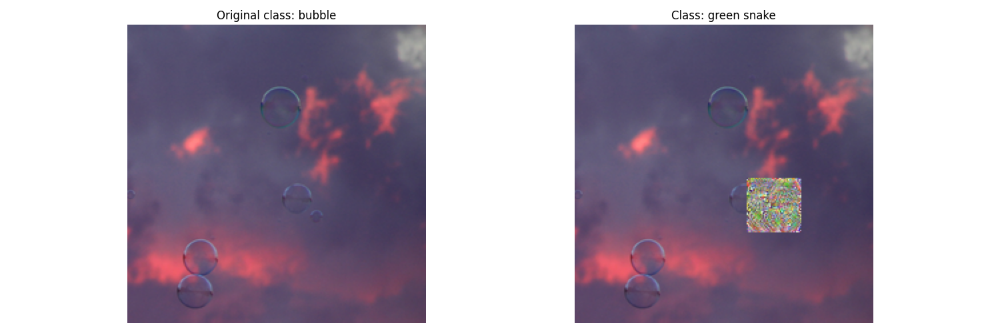

## Постановка задачи:

Разработка методов генерации физичеки реализуемых adversarial примеров и аналих эффективности их воздействия на предобученные нейросетевые модели для классификации и обнаружения людей, с акцентом на анализ изменений в точности(accuracy), достоверности классификации моделей при использовании их для задач классификации и обнаружения людей в режиме реального времени.

### Возможные варианты реализации:

- **Реализация атаки уклонения от системы распознавания лиц(face recognition system) с помощью очков или масок**;
- **Реализация атаки уклонения от системы распознавания людей с помощью верхней одежды со специальным рисунком или наклеенным враждебным патчем**;
- **Реализация атаки уклонения от системы распознавания объектов с помощью рамки**.

### Научные статьи/публикации по теме работы:

- **Реализация атаки уклонения от системы распознования лиц** 

  [Adversarial Mask: Real-World Universal Adversarial Attack on Face Recognition Models](https://arxiv.org/pdf/2111.10759)

  [Accessorize to a Crime: Real and Stealthy Attacks on State-of-the-Art Face Recognition](https://dl.acm.org/doi/pdf/10.1145/2976749.2978392)

  [ADVHAT: REAL-WORLD ADVERSARIAL ATTACK ON ARCFACE FACE ID SYSTEM](https://arxiv.org/pdf/1908.08705)

  [A General Framework for Adversarial Examples with Objectives](https://dl.acm.org/doi/pdf/10.1145/3317611)

- **Реализация атаки уклонения от системы распознования людей** 

  [Fooling automated surveillance cameras: adversarial patches to attack person detection](https://arxiv.org/pdf/1904.08653)

  [Adversarial T-shirt! Evading Person Detectors in A Physical World](https://arxiv.org/pdf/1910.11099)

  [Universal Physical Camouflage Attacks on Object Detectors](https://arxiv.org/pdf/1909.04326)
  
- **Реализация универсальных атак уклонения** 

  [Adversarial Patch](https://arxiv.org/pdf/1712.09665)

  [Robust Physical-World Attacks on Deep Learning Visual Classification](https://arxiv.org/pdf/1707.08945)

  [Physical Adversarial Examples for Object Detectors](https://arxiv.org/pdf/1807.07769)

  [Universal adversarial perturbations](https://arxiv.org/pdf/1610.08401)

  [ShapeShifter: Robust Physical Adversarial Attack on Faster R-CNN Object Detector](https://arxiv.org/pdf/1804.05810)
  

### Ход работы:

Для реализации был выбран алгоритм генерации универсального враждебного патча, так как он легко переносим в физическую форму. 

На данный момент реализован алгоритм поиска враждебного патча для одного изображения(файл [adv_patch.py](adv_patch.py) функция patch_attack). Данная атака является целевой и вынуждает классификатор классифицировать изображение в заданный целевой класс, независимо от его изначального содержания. Размер патча явлется параметризируемым, для оптимизации используется оптимизатор Adam.

В текущей реализации атака является не универсальной. Для достижения универсальности атаки ведутся доработки по обучению враждебного патча на всем наборе тренировочных изображений и оценки его эффективности на тестовом наборе данных((файл [adv_patch.py](adv_patch.py) функция patch_train)).

Пример враждебного патча для одного изображения:

  

